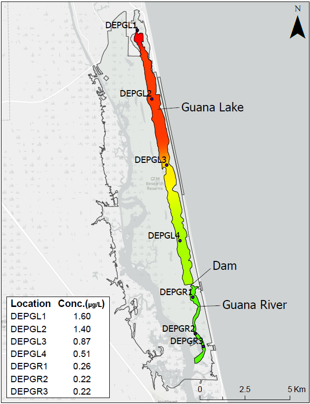

```{r setup, include=FALSE}
knitr::opts_chunk$set(echo = TRUE)
knitr::opts_chunk$set(message = FALSE)
knitr::opts_chunk$set(warning = FALSE)
```

```{r load, include = FALSE}
source('R/00_loadpackages.R')
source('R/00_vis_custom.R')
source('R/01_load_wrangle.R')
source('R/01_guana_wrangle_tidy.R')
source('R/01_guana_wrangle_qaqc.R')
source('R/01_met_wrangle.R')
source('R/01_guana_nut_wide.R')
```

# Background

The objective of this study effort was to quantify spatial/temporal variability of selected water quality parameters within the Guana system. Water quality observations in this system have been very limited historically and this study aimed to develop a baseline survey of water quality conditions over a variety of seasonal conditions and a spatial gradient. Besides the spatial gradient objective, sites were selected at Mickler’s weir and either side of Guana dam to study hydrologic connections. 

Monthly water sample collections began in the Guana system in July 2017 with five sites: Micklers, Lake Middle, Lake South, River North and Guana River. This totaled to three stations in the Guana Lake and two in the Guana River. Starting in July 2018, at the conclusion of the one-year pilot study, an additional five sampling stations were added after input and additional funding from FDEP's Division of Environmental Assessment and Restoration (DEAR) and Florida Fish and Wildlife Conservation Commission (FWC). The original five stations, plus these new five stations, were then sampled for another full year (Figure 1).

```{r mapimage, echo = FALSE, fig.cap = "Figure 1: Map of Water Quality Sampling Stations in Guana Lake and River between 2017-2019"}
knitr::include_graphics("images/Guana_10sites.png")
```

## Characterization

Northeast Florida has a humid subtropical climate characteristic of the Gulf and Atlantic coastal plain of the southeastern United States. The average annual rainfall is approximately 52 inches (132 cm) per year, with the wet season extending from June through September. During the study period, Hurricane Irma (September 2017) brought abnormally high amounts of precipitation to the area and the effects of this storm were observed for many months following the event (Figure 1).

```{r prcpplot, echo = FALSE, fig.width = 7, fig.cap = "Figure 1: Monthly total rainfall during the study period (July 2017 - June 2019) observed at the Florida Department of Environmental Protection's Tolomato River Station #872-0494 <http://fldep-stevens.com/station.php?site=8720494>."}
# convert mm rainfall into inches
met_dat_monthly$raininches <- (met_dat_monthly$monthlyrain)*0.0393701

met_dat_monthly %>%
  ggplot() +
  geom_bar(aes(x = datetime, y = raininches), stat = "identity", fill = 'gray') +
  theme_classic() +
  theme(# everything in theme is strictly aesthetics
    axis.title.x = element_blank(),
    axis.title.y = element_text(size=13),
    axis.ticks = element_line(color='black'),
    axis.text.x = element_text(angle = 90, vjust=0.3, size=12, color='black'),
    axis.text.y = element_text(size=12, color='black'),
    axis.ticks.x = element_line(color='black'),
    plot.title = element_text(size = 13, face='bold'),
    plot.subtitle = element_text(size = 11, face = 'italic'),
    panel.grid.minor = element_blank(),
    panel.grid.major = element_line(color='gray95')) +
  scale_y_continuous(expand = c(0,0)) +
  scale_x_date(date_breaks = '1 month', date_minor_breaks = '2 weeks', date_labels='%b-%y')+
  labs(x = 'date', y = 'rainfall (inches)')
```

Seasonal variation in temperature within the Reserve follows that of rainfall with a summer period of high temperatures between June and September and a cooler period extending from December through March. The average  air temperature recorded at the FDEP-Stevens Tolomato River Platform <http://fldep-stevens.com/station.php?site=8720494> during the timeframe of the sampling was 21.5 (C). 

The headwaters of the Guana River originate in the Diego Plains drainage area in Ponte Vedra Beach. This drainage basin encompasses approximately 7,800 acres (3,157 hectares). The Guana River runs parallel to the Tolomato on the seaward side, with the two lagoons joining 7 miles (11.3 km) north of the St. Augustine Inlet. The natural hydrology of the Guana Tolomato Matanzas system has been somewhat altered by water control structures, including dikes, inland wells, drainage ditches and a dam across a portion of the Guana River. Guana Lake receives water from the north at Mickler’s weir and water periodically exhanges with Guana River through the Guana dam depending on water level management and tidal conditions. As such, there often is a distinct latitudinal gradient in salinity within the lake, as evident in data collected at the time of water sample collections (Figure 2).

```{r salinityplot, echo = FALSE, fig.width = 7, fig.cap = "Figure 2: Salinity (psu) measured at each sampling station on the day of water sample collections."}
dat4 %>%
  filter(component_short == "SALT") %>%
  ggplot() +
  geom_line(aes(x = date_sampled, y = result, color = site), size = 1) +
  geom_point(aes(x = date_sampled, y = result, color = site), size = 3) +
  scale_colour_manual(values = sitecolours) +
  theme_classic() +
  theme(legend.title = element_blank(), # everything in theme is strictly aesthetics
        legend.position = "bottom",
        legend.text = element_text(size=12),
        axis.title.x = element_blank(),
        axis.title.y = element_text(size=13),
        axis.ticks = element_line(color='black'),
        plot.caption = element_text(size=6, face='italic'),
        axis.text.x = element_text(angle = 90, vjust=0.3, size=12, color='black'),
        axis.text.y = element_text(size=12, color='black'),
        axis.ticks.x = element_line(color='black'),
        plot.title = element_text(size = 16, face='bold'),
        panel.grid.minor = element_blank(),
        panel.grid.major = element_line(color='gray95')) +
  scale_y_continuous(expand = c(0,0)) +
  scale_x_datetime(date_breaks = '1 month', date_minor_breaks = '2 weeks', date_labels='%b-%y') +
  labs(x = '', y = "Salinity (psu)") 
```

Water temperatures in both the lake and the river follow similar seasonal patterns and do not diverge too much between waterbodies (Figure 3).

```{r wtempplot, echo = FALSE, fig.width = 7, fig.cap = "Figure 3: Water temperatures (C) measured at each sampling station on the day of water sample collections."}
dat4 %>%
  filter(component_short == "WTEM") %>%
  ggplot() +
  geom_line(aes(x = date_sampled, y = result, color = site), size = 1) +
  geom_point(aes(x = date_sampled, y = result, color = site), size = 3) +
  scale_colour_manual(values = sitecolours) +
  theme_classic() +
  theme(legend.title = element_blank(), # everything in theme is strictly aesthetics
        legend.position = "bottom",
        legend.text = element_text(size=12),
        axis.title.x = element_blank(),
        axis.title.y = element_text(size=13),
        axis.ticks = element_line(color='black'),
        plot.caption = element_text(size=6, face='italic'),
        axis.text.x = element_text(angle = 90, vjust=0.3, size=12, color='black'),
        axis.text.y = element_text(size=12, color='black'),
        axis.ticks.x = element_line(color='black'),
        plot.title = element_text(size = 16, face='bold'),
        panel.grid.minor = element_blank(),
        panel.grid.major = element_line(color='gray95')) +
  scale_y_continuous(expand = c(0,0)) +
  scale_x_datetime(date_breaks = '1 month', date_minor_breaks = '2 weeks', date_labels='%b-%y') +
  labs(x = '', y = temp_y_title) 
```
<br>

# Methods

All samples were obtained during the same ebb tide of each sampling day and within one day of the GTMNERR monthly collections for nutrient analyses at the System-Wide Monitoring Program stations. No distinction was made between neap and spring tide conditions. All water samples were sent to ALS Environmental Labs in Jacksonville, FL for nutrient and bacterial analyses with the exception of September and December 2018 and February and May 2019, which were sent to the Florida Department of Environmental Protection (FDEP) Central Laboratory in Tallahassee, FL. In September 2018 and February 2019, additional samples were taken and sent to Source Molecular Labs in Miami, FL for fecal source tracking. *For more specific information regarding methodology, please see the provided metadata report*. 

All of the data included in the calculations and figures have been provisionally reviewed by GTMNERR staff. Included in the dataset are laboratory remarks, which use the FDEP lab codes, and flags, which are determined using the National Estuarine Research Reserve (NERR) System's Centralized Data Management Office (CDMO). The Data Management Manual can be downloaded from <http://cdmo.baruch.sc.edu/request-manuals/>. For any further questions, please reach out to the project’s principal investigator, Dr. Nikki Dix (Nikki.Dix@floridadep.gov).

## Parameters available in data set

```{r parametertable, echo = FALSE}
a <- as.data.frame(unique(dat4$component_long))
a$observation <- 1:nrow(a)
b <- as.data.frame(unique(dat4$component_short))
b$observation <- 1:nrow(b)
table <- dplyr::full_join(a, b, by = 'observation')

table <- table[,c(1,3)] # reorder and remove the "observation" column

# rename columns
colnames(table)[1] <- "Parameter"
colnames(table)[2] <- "Abbrev"
rm(a, b)

knitr::kable(table)
rm(table)
```

# Physical and Chemical Indicators of Water Quality

## Dissolved oxygen (% saturation), turbidity, total suspended solids, and sucralose. 

```{r doplot, echo = FALSE, fig.width = 7, fig.cap = "Figure 4: Dissolved oxygen (% saturation) measured at each sampling station on the day of water sample collections. Horizontal line represents the Florida state threshold criteria of 38% saturation for both Class II and III estuarine waters."}
dat4 %>%
  filter(component_short == "DO_p") %>%
  ggplot() +
  geom_line(aes(x = date_sampled, y = result, color = site), size = 1) +
  geom_point(aes(x = date_sampled, y = result, color = site), size = 3) +
  geom_hline(yintercept = 38, linetype = 'longdash', color = 'gray18', size = 1.5) +
  scale_colour_manual(values = sitecolours) +
  theme_classic() +
  theme(legend.title = element_blank(), # everything in theme is strictly aesthetics
        legend.position = "bottom",
        legend.text = element_text(size=12),
        axis.title.x = element_blank(),
        axis.title.y = element_text(size=13),
        axis.ticks = element_line(color='black'),
        plot.caption = element_text(size=6, face='italic'),
        axis.text.x = element_text(angle = 90, vjust=0.3, size=12, color='black'),
        axis.text.y = element_text(size=12, color='black'),
        axis.ticks.x = element_line(color='black'),
        plot.title = element_text(size = 16, face='bold'),
        panel.grid.minor = element_blank(),
        panel.grid.major = element_line(color='gray95')) +
  scale_y_continuous(expand = c(0,0)) +
  scale_x_datetime(date_breaks = '1 month', date_minor_breaks = '2 weeks', date_labels='%b-%y') +
  labs(x = '', y = "Dissolved oxygen (% sat)") 
```

*Which of the following graphs to use for turbidity/TSS since they both show similar patterns?*

```{r turbtssplot, echo = FALSE, fig.width = 7, fig.cap = "Figure x: Turbidity (NTU) and Total Suspended Solids (TSS)."}
dat4 %>%
  filter(component_short == "Turbidity") %>%
  ggplot() +
  geom_line(aes(x = date_sampled, y = result, color = site), size = 1) +
  geom_point(aes(x = date_sampled, y = result, color = site), size = 3) +
  scale_colour_manual(values = sitecolours) +
  theme_classic() +
  theme(legend.title = element_blank(), # everything in theme is strictly aesthetics
        legend.position = "bottom",
        legend.text = element_text(size=12),
        axis.title.x = element_blank(),
        axis.title.y = element_text(size=13),
        axis.ticks = element_line(color='black'),
        plot.caption = element_text(size=6, face='italic'),
        axis.text.x = element_text(angle = 90, vjust=0.3, size=12, color='black'),
        axis.text.y = element_text(size=12, color='black'),
        axis.ticks.x = element_line(color='black'),
        plot.title = element_text(size = 16, face='bold'),
        panel.grid.minor = element_blank(),
        panel.grid.major = element_line(color='gray95')) +
  scale_y_continuous(expand = c(0,0)) +
  scale_x_datetime(date_breaks = '1 month', date_minor_breaks = '2 weeks', date_labels='%b-%y') +
  labs(x = '', y = "Turbidity (NTU)") 

dat4 %>%
  filter(component_short == "TSS") %>%
  ggplot() +
  geom_line(aes(x = date_sampled, y = result, color = site), size = 1) +
  geom_point(aes(x = date_sampled, y = result, color = site), size = 3) +
  scale_colour_manual(values = sitecolours) +
  theme_classic() +
  theme(legend.title = element_blank(), # everything in theme is strictly aesthetics
        legend.position = "bottom",
        legend.text = element_text(size=12),
        axis.title.x = element_blank(),
        axis.title.y = element_text(size=13),
        axis.ticks = element_line(color='black'),
        plot.caption = element_text(size=6, face='italic'),
        axis.text.x = element_text(angle = 90, vjust=0.3, size=12, color='black'),
        axis.text.y = element_text(size=12, color='black'),
        axis.ticks.x = element_line(color='black'),
        plot.title = element_text(size = 16, face='bold'),
        panel.grid.minor = element_blank(),
        panel.grid.major = element_line(color='gray95')) +
  scale_y_continuous(expand = c(0,0)) +
  scale_x_datetime(date_breaks = '1 month', date_minor_breaks = '2 weeks', date_labels='%b-%y') +
  labs(x = '', y = "Total Suspended Solids (mg/L)") 
```

```{r sucraimage, echo = FALSE, fig.cap = "Figure x: Map of interpolated sucralose in Guana system in September 2018."}

```

## Nutrients: nitrogen and phosphorus

```{r TNplot, echo = FALSE, fig.height = 7.5, fig.width = 6, fig.cap = "Figure x: Total Nitrogen (mg/L) collected at each sampling station on the day of water sample collections in the lake (A) and river (B). Horizontal line represents the Florida state threshold criteria for Class II estuarine waters (0.65 mg/L)."}
# use the dat_nut dataframe from 
# source('R/01_guana_nut_wide.R')
# calculate a new TN, since it is not reported for each month = TKN + NO23
dat_nut$TN_calc <- dat_nut$TKN + dat_nut$NO23F

# lake and river have different threshold values. The lake is numerical, but the river has a threshold value of 0.65 mg/L 

# lake 
a <- dat_nut %>%
  filter(WBID == "Lake") %>%
  ggplot() +
  geom_line(aes(x = date_sampled, y = TN_calc, color = site), size = 1) +
  geom_point(aes(x = date_sampled, y = TN_calc, color = site), size = 3) +
  scale_colour_manual(values = sitecolours) +
  theme_classic() +
  theme(legend.title = element_blank(), # everything in theme is strictly aesthetics
        legend.position = "bottom",
        legend.text = element_text(size=12),
        axis.title.x = element_blank(),
        axis.title.y = element_text(size=13),
        axis.ticks = element_line(color='black'),
        plot.caption = element_text(size=6, face='italic'),
        axis.text.x = element_text(angle = 90, vjust=0.3, size=12, color='black'),
        axis.text.y = element_text(size=12, color='black'),
        axis.ticks.x = element_line(color='black'),
        plot.title = element_text(size = 16, face='bold'),
        panel.grid.minor = element_blank(),
        panel.grid.major = element_line(color='gray95')) +
  scale_y_continuous(expand = c(0,0)) +
  scale_x_datetime(date_breaks = '1 month', date_minor_breaks = '2 weeks', date_labels='%b-%y') +
  labs(x = '', y = nitro_y_title,
       title = "A") 

# river 
b <- dat_nut %>%
  filter(WBID == "River") %>%
  ggplot() +
  geom_line(aes(x = date_sampled, y = TN_calc, color = site), size = 1) +
  geom_point(aes(x = date_sampled, y = TN_calc, color = site), size = 3) +
  geom_hline(yintercept = 0.65, linetype = 'longdash', color = 'gray18', size = 1.5) +
  scale_colour_manual(values = sitecolours) +
  theme_classic() +
  theme(legend.title = element_blank(), # everything in theme is strictly aesthetics
        legend.position = "bottom",
        legend.text = element_text(size=12),
        axis.title.x = element_blank(),
        axis.title.y = element_text(size=13),
        axis.ticks = element_line(color='black'),
        plot.caption = element_text(size=6, face='italic'),
        axis.text.x = element_text(angle = 90, vjust=0.3, size=12, color='black'),
        axis.text.y = element_text(size=12, color='black'),
        axis.ticks.x = element_line(color='black'),
        plot.title = element_text(size = 16, face='bold'),
        panel.grid.minor = element_blank(),
        panel.grid.major = element_line(color='gray95')) +
  scale_y_continuous(expand = c(0,0)) +
  scale_x_datetime(date_breaks = '1 month', date_minor_breaks = '2 weeks', date_labels='%b-%y') +
  labs(x = '', y = nitro_y_title,
       title = "B") 

gridExtra::grid.arrange(a, b)

# clean up
rm(a,b)
```

```{r TPplot, echo = FALSE, fig.height = 7.5, fig.width = 6, fig.cap = "Figure x: Total Phosphorus (mg/L) collected at each sampling station on the day of water sample collections in the lake (A) and river (B). Horizontal line represents the Florida state threshold criteria for Class II estuarine waters (0.105 mg/L)."}
# lake threshold is narrative, but river is 0.105 mg/L 
# lake
a <- dat4 %>%
  filter(WBID == "Lake" & component_short == "TP") %>%
  ggplot() +
  geom_line(aes(x = date_sampled, y = result, color = site), size = 1) +
  geom_point(aes(x = date_sampled, y = result, color = site), size = 3) +
  scale_colour_manual(values = sitecolours) +
  theme_classic() +
  theme(legend.title = element_blank(), # everything in theme is strictly aesthetics
        legend.position = "bottom",
        legend.text = element_text(size=12),
        axis.title.x = element_blank(),
        axis.title.y = element_text(size=13),
        axis.ticks = element_line(color='black'),
        plot.caption = element_text(size=6, face='italic'),
        axis.text.x = element_text(angle = 90, vjust=0.3, size=12, color='black'),
        axis.text.y = element_text(size=12, color='black'),
        axis.ticks.x = element_line(color='black'),
        plot.title = element_text(size = 16, face='bold'),
        panel.grid.minor = element_blank(),
        panel.grid.major = element_line(color='gray95')) +
  scale_y_continuous(expand = c(0,0)) +
  scale_x_datetime(date_breaks = '1 month', date_minor_breaks = '2 weeks', date_labels='%b-%y') +
  labs(x = '', y = phos_y_title,
       title = "A") 

b <- dat4 %>%
  filter(WBID == "River" & component_short == "TP") %>%
  ggplot() +
  geom_line(aes(x = date_sampled, y = result, color = site), size = 1) +
  geom_point(aes(x = date_sampled, y = result, color = site), size = 3) +
  geom_hline(yintercept = 0.105, linetype = 'longdash', color = 'gray18', size = 1.5) +
  scale_colour_manual(values = sitecolours) +
  theme_classic() +
  theme(legend.title = element_blank(), # everything in theme is strictly aesthetics
        legend.position = "bottom",
        legend.text = element_text(size=12),
        axis.title.x = element_blank(),
        axis.title.y = element_text(size=13),
        axis.ticks = element_line(color='black'),
        plot.caption = element_text(size=6, face='italic'),
        axis.text.x = element_text(angle = 90, vjust=0.3, size=12, color='black'),
        axis.text.y = element_text(size=12, color='black'),
        axis.ticks.x = element_line(color='black'),
        plot.title = element_text(size = 16, face='bold'),
        panel.grid.minor = element_blank(),
        panel.grid.major = element_line(color='gray95')) +
  scale_y_continuous(expand = c(0,0)) +
  scale_x_datetime(date_breaks = '1 month', date_minor_breaks = '2 weeks', date_labels='%b-%y') +
  labs(x = '', y = phos_y_title,
       title = "B")

gridExtra::grid.arrange(a, b)

# clean up
rm(a,b)
```

# Biological Indicators

The chlorophyll *a* data presented in the figures and used in calculations of the annual geometric mean has had the pheophytin correction. 

# Discussion

## Guana Dam 

"for instance...salinities converge"

```{r salinitydamplot, echo = FALSE, fig.width = 7, fig.cap = "Figure #: Salinity (psu) measured at each sampling station on the day of water sample collections. Vertical lines indicate status of the Guana Dam during construction in 2018. Dashed lines are when the dam was closed off for construction and the dotted lines are when it was opened again for water exchange."}
dat4 %>%
  filter(component_short == "SALT") %>%
  ggplot() +
  geom_line(aes(x = date_sampled, y = result, color = site), size = 1) +
  geom_point(aes(x = date_sampled, y = result, color = site), size = 3) +
  geom_vline(aes(xintercept = as.integer(as.POSIXct("2018-03-26"))),
             col="black", linetype='dashed', size=1) + # closed dam
  geom_vline(aes(xintercept = as.integer(as.POSIXct("2018-07-11"))),
             col="black", linetype='dotted', size=1) + # opened dam
  geom_vline(aes(xintercept = as.integer(as.POSIXct("2018-08-08"))),
             col="black", linetype='dashed', size=1) + # closed dam
  geom_vline(aes(xintercept = as.integer(as.POSIXct("2018-10-30"))),
             col="black", linetype='dotted', size=1) + # opened dam
  scale_colour_manual(values = sitecolours) +
  theme_classic() +
  theme(legend.title = element_blank(), # everything in theme is strictly aesthetics
        legend.position = "bottom",
        legend.text = element_text(size=12),
        axis.title.x = element_blank(),
        axis.title.y = element_text(size=13),
        axis.ticks = element_line(color='black'),
        plot.caption = element_text(size=6, face='italic'),
        axis.text.x = element_text(angle = 90, vjust=0.3, size=12, color='black'),
        axis.text.y = element_text(size=12, color='black'),
        axis.ticks.x = element_line(color='black'),
        plot.title = element_text(size = 16, face='bold'),
        panel.grid.minor = element_blank(),
        panel.grid.major = element_line(color='gray95')) +
  scale_y_continuous(expand = c(0,0)) +
  scale_x_datetime(date_breaks = '1 month', date_minor_breaks = '2 weeks', date_labels='%b-%y') +
  labs(x = '', y = "Salinity (psu)") 
```
